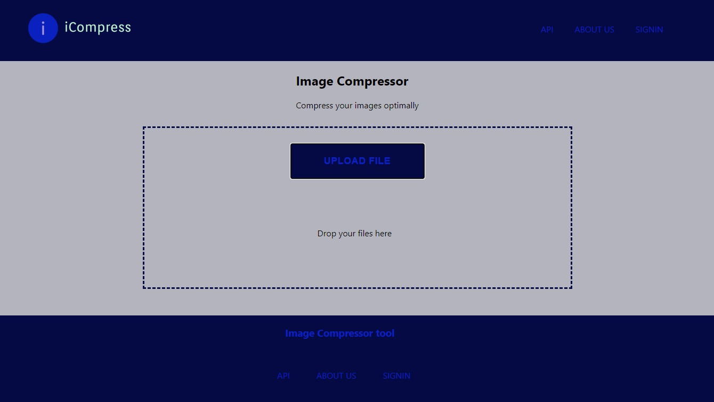

# Image Compression Algorithm

## Introduction

This project is an image compression web application that allows users to upload images and compress them using both lossy and lossless compression techniques. It was built as part of a portfolio project aimed at improving the efficiency of image handling and reducing file sizes without compromising quality.

You can visit the deployed version of the project [here](https://your-deployed-site-link.com).


Read more about the project in our detailed blog post [here](https://www.linkedin.com/pulse/building-efficient-image-compression-application-olayiwola-sulaimon-ka2hf).

Connect with the author on LinkedIn:

- [Olayiwola Sulaimon](https://www.linkedin.com/in/olayiwola-sulaimon/)
- [Sudais Sumaila](https://www.linkedin.com/in/sumaila-sudais-ballah-38795b235/)
- [Bereket Meketa](https://www.linkedin.com/in/your-profile-link/)

<!-- Replace with a link to an actual screenshot of your app -->


## Installation

To get a local copy of this project up and running, follow these steps:

### Clone the repository:
```bash
    git clone https://github.com/Solayiwo/image-compression-algorithm.git
    cd image-compression-algorithm
```

### Install the required dependencies: Ensure you have Python and PostgreSQL installed. Then run:
```bash
    pip install -r requirements.txt
```

### Set up the database: 
- You will need to configure your PostgreSQL database settings in the settings.py file.

### Run migrations:
```bash
    python manage.py migrate
```
### Start the development server:
```bash
    python manage.py runserver
```

## Usage

- **Register or Login**: Users can register for an account or use guest access to upload and compress images.

- **Upload and Compress**: Once logged in, users can upload an image, choose between lossy and lossless compression, and download the compressed version.

- **Generate Report**: Users can generate a PDF report summarizing the compression results, including the original and compressed sizes, compression ratio, and more.

## Contributing

We welcome contributions to improve this project. If you would like to contribute, please follow these steps:

- Fork the repository
- Create a new feature branch (git checkout -b feature/YourFeature)
- Commit your changes (git commit -m 'Add feature')
- Push to the branch (git push origin feature/YourFeature)
- Open a pull request

## Related Projects

Check out these other projects related to image compression and web development:

- [ImageOptim](https://imageoptim.com/)
- [TinyPNG](https://tinypng.com/)

## Licensing

This project is licensed under the MIT License. See the [LICENSE](LICENSE) file for more details.


## Story & Technical Challenges

The inspiration behind this project stemmed from the growing need for optimized image handling on websites and mobile applications, particularly for users with low bandwidth. We were excited to build a solution that compresses images without losing their quality.

## Key Challenges

- **Compression Algorithms**: We had to choose between several algorithms for lossy and lossless compression. After researching various options, we decided on JPEG for lossy compression due to its wide support and PNG for lossless compression, as it preserves quality for detailed images.

- **Database Integration**: Storing the compressed image files and their metadata in a PostgreSQL database was tricky at first, but using Django's ORM helped streamline the process. We made sure to store and compressed versions to allow signup users have access to it anytime.

- **PDF Report Generation**: One of the more technical challenges was generating PDF reports. I used the reportlab library, which allowed me to create PDF files dynamically from HTML templates.

## What We Struggled With

While the core functionality of the application works well, we faced challenges with the user experience, particularly around handling larger images efficiently and ensuring that the compression process run successfully. This is an area we aim to improve in future iterations.

## Next Iteration

In the next version, we plan to:

- Add cloud storage integration for handling larger images.
- Implement an image optimization feature that suggests the best compression method based on the image type.

This project was built over the course of several weeks and pushed us to dive deeper into both backend and frontend development. We learned a lot about image processing libraries, Django's features, and web performance optimization.
